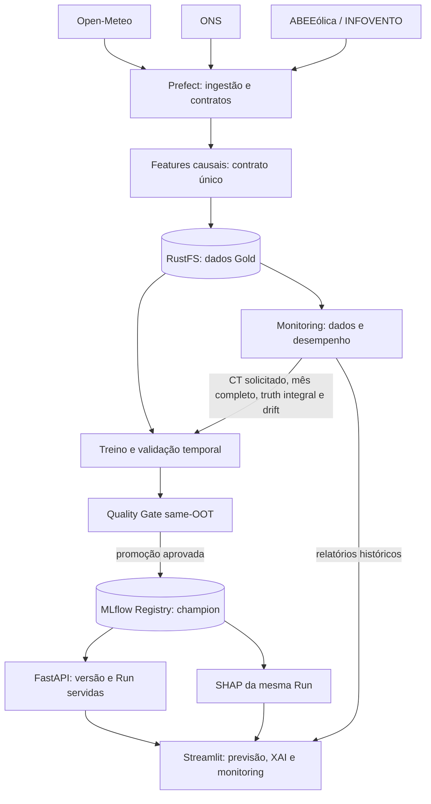
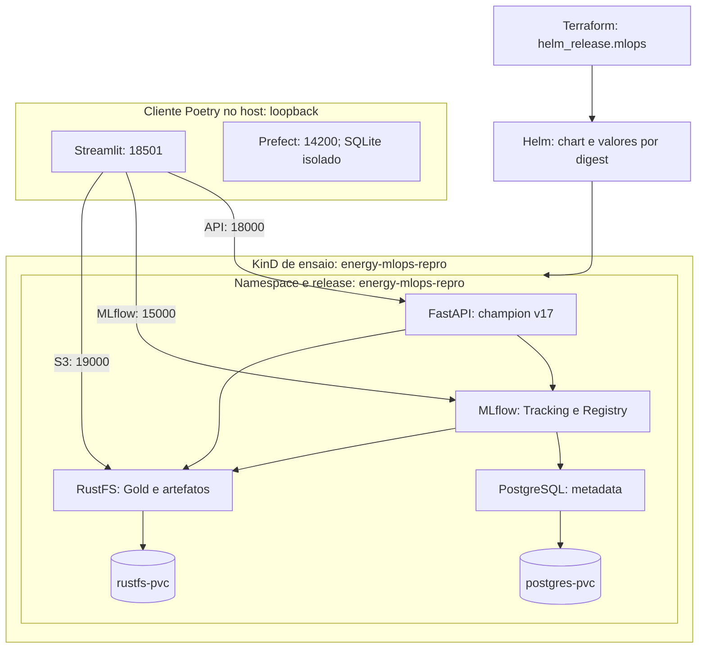

# Renewable Energy MLOps — Wind Power Forecasting

[](https://github.com/wanderson42/renewable-energy-mlops/releases/latest)
[](https://github.com/wanderson42/renewable-energy-mlops/actions/workflows/ci_cd.yaml)


[](LICENSE)

Sistema MLOps end-to-end para **previsão horária Day-Ahead de geração eólica na Bahia**, cobrindo ingestão de dados, contratos de features, validação temporal, otimização de hiperparâmetros, experiment tracking, Model Registry, explicabilidade, monitoramento de drift, Continuous Training, model serving, operação local em Kubernetes e infraestrutura declarativa com Terraform/Helm.

O modelo aprende o **fator de capacidade (`target_fc`)** e reconstrói a previsão operacional em MW usando a capacidade disponível. O foco do projeto não é apenas treinar um regressor, mas preservar contratos consistentes entre **dados → treinamento → registry → serving → monitoring → retraining**.

> **Escopo:** projeto educacional e de portfólio. O repositório demonstra práticas de engenharia e MLOps; não deve ser interpretado como sistema certificado para decisões reais de despacho energético.

## Visão geral

Para uma leitura executiva do problema, dos resultados e do caminho para produção, consulte o **[resumo para stakeholders](docs/STAKEHOLDER_BRIEF.md)**. O documento reúne a justificativa para Bahia e Morro do Chapéu, a interpretação das métricas e referências sobre complementaridade eólica–solar.

### Ciclo de dados e modelos



### Dois lifecycles distintos

O projeto separa explicitamente:

- **Software lifecycle:** build/testes/publicação por Actions; deployment local do ensaio por plano/apply Terraform, Helm, rollout e gates. A origem da v0.3 mantém seu rollout manual.
- **Model lifecycle:** monitoring observacional; CT exige solicitação explícita, mês completo, truth integral e drift. Challenger passa pelo Quality Gate same-OOT antes de `@champion` e hot reload.

Treinar um novo modelo não implica publicar uma nova imagem, e publicar uma nova imagem da API não implica retreinar o modelo.

## Estado atual — 2026-10-05

| Item | Estado |
|---|---|
| Modelo registrado | `ensemble_lgb_xgb_rf_bahia` |
| Alias operacional | `@champion` |
| Champion | **v17** |
| Run ID | `1d13a61244c54f06aa70f43a9993ea37` |
| OOT MAE | **787.1836 MW** |
| OOT nMAE | **6.6788%** |
| OOT R² | **0.8614** |
| Features do modelo | **9** |
| Governança | **`same_oot_v1`; v17 promovida após comparação com v10 no mesmo OOT** |
| Primeira janela de monitoring v0.3 | **96 horas meteorológicas; 72 com truth** |
| Threshold de Data Drift | **50%** |
| Validação consolidada da v0.3 | **154 passed / 0 failed; resultado histórico de 05/10/2026** |
| Deployment de ensaio | **KinD separado, Terraform/Helm, restore, serving pareado e recuperação declarativa** |
| Cliente de ensaio | **Gate SDK/HTTP aprovado; dashboard e recuperação da UI Prefect confirmados pelo operador** |
| v1.0 | **Implementação integrada à main: deployment local reproduzível e blueprint AWS validado sem provisionamento cloud** |
| CI da main após o merge | **225 passed, 1 skipped, 2 warnings; 56 subtests passed** |
| Terraform | **6 testes locais e 7 testes AWS com mocks; lint e controles de segurança selecionados aprovados** |
| Warnings conhecidos | **2 — Evidently/NumPy, não bloqueantes** |

Na etapa histórica anterior, o Challenger v12 apresentou `837.85 MW` de MAE OOT,
`7.11%` de nMAE e `R² = 0.8438`, sendo rejeitado. Posteriormente, a v17 foi
promovida por um gate independente: v10 e v17 foram reavaliadas no mesmo OOT
de setembro/2026. A v10 obteve `803.3723 MW`, e a v17, `787.1836 MW`.
Esses resultados não substituem retroativamente as métricas dos benchmarks.

A implementação da v1.0 foi integrada pelo [PR #4](https://github.com/wanderson42/renewable-energy-mlops/pull/4), commit `2b07c40`. O [recibo de consolidação](docs/evidence/v1_consolidation_2026-10-05.json) vincula os resultados aos workflows dessa revisão. O [notebook da infraestrutura](notebooks/operations/reproducible_deployment_v1_0.ipynb) preserva a análise detalhada. O acompanhamento longitudinal da v0.3 permanece em andamento.

### Experimento de simplificação — v0.2.0

O experimento v0.2.0 avaliou três arquiteturas sobre **o mesmo snapshot temporal congelado**, com 21.425 observações de treino, 720 observações OOT de setembro/2026, 9 features, 20 trials Optuna, 3 splits externos e 5 splits internos do Stacking.

| Arquitetura | OOT MAE (MW) | OOT nMAE (%) | OOT R² |
|---|---:|---:|---:|
| LGBM + XGB + RF | **774.90** | **6.57** | **0.8666** |
| LGBM + RF | 788.35 | 6.69 | 0.8633 |
| LGBM + XGB | 785.31 | 6.66 | 0.8641 |

A hipótese original de remover o XGBoost não foi sustentada no novo snapshot. `LGBM + XGB` foi o melhor candidato reduzido, mas o ensemble completo manteve os melhores valores pontuais no OOT.

O benchmark é tratado como **evidência experimental** e não promoveu automaticamente
nenhum modelo. A v10 permaneceu champion naquele momento; a promoção posterior
da v17 exigiu o Quality Gate same-OOT da v0.3.


### Experimento de janela temporal de treinamento

Após o benchmark de simplificação, um segundo experimento manteve fixa a arquitetura
`LGBM + XGB + RF` e alterou apenas a quantidade de histórico disponível para o TRAIN.

Foram comparadas três políticas:

```text
Expanding
Rolling 24 meses
Rolling 12 meses
```

O contrato experimental permaneceu fixo em 9 features, OOT de setembro/2026,
20 trials Optuna, 3 splits externos e 5 splits internos do Stacking.

| Janela | TRAIN rows | CV nMAE mean (%) | CV nMAE std (%) | OOT MAE (MW) | OOT nMAE (%) | OOT R² |
|---|---:|---:|---:|---:|---:|---:|
| Expanding | 21,425 | 8.6949 | 0.6791 | **787.18** | **6.6788** | **0.8614** |
| Rolling 24m | 17,486 | 9.1920 | 1.6572 | 937.14 | 7.9511 | 0.8217 |
| Rolling 12m | 8,760 | **8.1086** | 0.8133 | 889.66 | 7.5483 | 0.8297 |

Para este snapshot e este holdout futuro, a **Expanding Window** apresentou o melhor
desempenho OOT. O Rolling 12m obteve o menor nMAE médio na validação interna, mas essa
vantagem não se transferiu para o OOT, reforçando a necessidade de avaliar CV temporal
e holdout futuro separadamente.

A conclusão é contextual: o resultado não demonstra superioridade universal da
Expanding Window. A política passou a ser parametrizável por `training_window_months`
para permitir repetição do benchmark em novos períodos OOT.

A evidência detalhada está em
[`notebooks/experiments/training_window_comparison_v0_2_0.ipynb`](notebooks/experiments/training_window_comparison_v0_2_0.ipynb).


## Dashboard operacional

### Day-Ahead Forecasting & Explainability


A interface consome previsão meteorológica real da Open-Meteo para **Morro do Chapéu - BA**, executa inferência em lote via FastAPI e exibe indicadores de geração, curvas horárias, metadados do Champion e explicabilidade SHAP vinculada ao `run_id` efetivamente servido.

### Monitoring — Data Drift & Performance Drift


O relatório do Evidently monitora apenas as features pertencentes ao contrato do
modelo. Data Drift e Performance Drift são avaliados separadamente. Monitoring
é observacional por padrão; CT exige solicitação explícita, mês completo, truth
integral e algum sinal de drift. A promoção depende do Quality Gate same-OOT.

## Proveniência dos dados

O contrato atual separa claramente as fontes:

- **meteorologia:** Open-Meteo;
- **geração eólica horária:** ONS;
- **capacidade instalada canônica:** checkpoints históricos da ABEEólica / INFOVENTO;
- **ANEEL:** fonte diagnóstica para reconciliação de eventos, não usada para reconstruir `capacidade_mw`.

A capacidade é aplicada causalmente: cada timestamp utiliza somente o checkpoint mais recente já disponível. Não são usados interpolação linear nem backward fill. O histórico canônico de capacidade utilizado na v0.2.0 começa em **2024-03-21**.

Na extração do ONS, horas com registros incompletos de geração são descartadas antes da agregação estadual; valores ausentes de usinas não são transformados em `0 MW`.

## ETL — extração, transformação e carga

O fluxo mensal [`data_ingestion_flow`](src/energy_mlops/pipelines/data_ingestion_flow.py), orquestrado pelo **Prefect**, transforma as fontes externas em um **snapshot Gold auditado**, pronto para a construção dos conjuntos temporais de treinamento e avaliação.

| Etapa | Procedimento implementado |
|---|---|
| **Extract — extração** | Consulta a Open-Meteo Archive API para velocidade e direção do vento a 100 m e temperatura a 2 m em Morro do Chapéu; lê o Parquet mensal do ONS, filtra a geração eólica da Bahia e agrega as horas com registros válidos. As tarefas de extração possuem retries e os resultados passam pelos contratos `WeatherSchema` e `EnergySchema`. |
| **Transform — transformação** | Alinha os timestamps em UTC, verifica se a série ONS alcança o fechamento do mês e faz um `inner join` por `date`. Aplica os checkpoints versionados de capacidade ABEEólica/INFOVENTO conforme sua disponibilidade histórica; calcula `target_fc` (geração/capacidade, limitado a `[0, 1]`), a relação vento/temperatura, os ciclos de hora e mês e a média móvel causal de vento de três horas. |
| **Load — carga** | Audita o snapshot e grava o dataset em Parquet na camada Gold do RustFS, pelo endpoint compatível com S3. Em caso de falha na escrita, salva o arquivo no disco local e retorna o caminho efetivamente utilizado. |

Antes da carga, [`audit_gold_snapshot`](src/energy_mlops/data/snapshot_validation.py) verifica ordenação temporal, timestamps duplicados, contrato de features, valores de geração e capacidade e consistência de `target_fc`. Também registra lacunas horárias e confere se a capacidade aplicada corresponde ao checkpoint causalmente disponível. Essa auditoria torna explícita a qualidade do dataset entregue ao treinamento.

### Executar a ingestão mensal

Com o ambiente Python e o `.env` configurados conforme o [Quick Start](#quick-start), execute, por exemplo, a ingestão de janeiro de 2025:

```bash
poetry run python -m energy_mlops.pipelines.data_ingestion_flow --year 2025 --month 1
```

O parâmetro `RUSTFS_BUCKET` define o bucket de destino. A saída segue estes caminhos:

```text
RustFS: s3://<RUSTFS_BUCKET>/gold/dataset_renewable_energy_2025_01.parquet
Fallback local: data/dataset_renewable_energy_2025_01.parquet
```

O fluxo valida o fechamento da publicação mensal do ONS antes de gerar o Gold; lacunas internas são registradas pela auditoria. A ingestão prepara os dados, enquanto treinamento e promoção do modelo seguem seus próprios fluxos e critérios de governança.

## Arquitetura de modelagem

O modelo operacional usa `TemporalStackingRegressor` com OOF causal:

```text
LightGBM ───┐
XGBoost ────┼──> OOF temporal ──> LinearRegression
RandomForest┘                    positive=True
                                  fit_intercept=False
```

A validação usa `TimeSeriesSplit`. O bloco inicial que não possui previsão OOF é excluído do treinamento do meta-learner; depois, os modelos base são refitados sobre todo o conjunto de treino disponível.

Na v0.2.0, os estimadores base passaram a ser configuráveis para suportar ablações controladas (`LGBM + XGB + RF`, `LGBM + RF` e `LGBM + XGB`) sem duplicar trainers. Essa flexibilidade serve ao experimento; a arquitetura operacional continua sendo o stack completo enquanto não houver uma decisão explícita de lifecycle.

### Contrato canônico de features

A seleção das features é centralizada por `ModelFeatureSchema`; otimização, treinamento, serving e monitoring não mantêm listas paralelas.

```text
temperature_2m
wind_speed_100m
wind_direction_100m
wind_temp_ratio
hour_sin
hour_cos
month_sin
month_cos
wind_speed_roll_mean_3h
```

A rolling de vento de 3 horas é construída de forma causal e **gap-safe**, usando uma janela cronológica de três horas em vez das três linhas anteriores. Isso evita leakage temporal e impede que a feature atravesse artificialmente grandes lacunas do dataset.

### Métricas canônicas

Novas Runs MLflow registram:

```text
oot_mae_mw
oot_nmae_pct
oot_mae_fc_pct
oot_r2_score
```

O ano não faz parte do nome das métricas. Runs históricas podem ser lidas por uma camada de compatibilidade `_<YYYY>` enquanto ainda houver modelos operacionais antigos que dependam dela.

## Continuous Training e Quality Gate

O orquestrador Prefect é agnóstico em relação ao algoritmo de treinamento:

```text
optimizer_name="stacking"
        ↓
Optuna → best_params → trainer

optimizer_name="none"
        ↓
pula a otimização
        ↓
trainer recebe None / None
```

Cada `ModelTrainer` decide se otimização é obrigatória. O Stacking atual exige `best_params` e `optimization_run_id`; `train_examples.py` demonstra um Ridge compatível com execução sem optimizer.

A promoção de Challenger para Champion só ocorre após o **Quality Gate**. Na
execução E2E histórica da v0.1, o Monitoring detectou drift, o CT treinou a v12
e o gate decidiu manter a v10. Na v0.3, o gate same-OOT promoveu a v17;
não promover também continua sendo um resultado esperado de governança.

A regra atual de parcimônia considera **redução do número de features**, não redução do número de estimadores base. Por isso, ela não foi usada para decidir automaticamente entre as arquiteturas do experimento v0.2.0, que compartilham o mesmo contrato de 9 features.


A política de construção do TRAIN também é explícita:

```text
training_window_months=None  -> Expanding
training_window_months=24    -> Rolling 24m
training_window_months=12    -> Rolling 12m
```

A escolha da janela é uma configuração experimental/de treinamento e não constitui,
por si só, um critério de promoção no Quality Gate.

## Persistência e resiliência local

O MLflow separa estado persistente em dois backends:

```text
MLflow metadata  -> PostgreSQL -> postgres-pvc
MLflow artifacts -> RustFS     -> rustfs-pvc
```

A persistência foi validada de forma controlada após restart individual dos deployments
de PostgreSQL e RustFS e também após restart do container `energy-mlops-control-plane`.
A mesma Run canary manteve parâmetros, métricas e artifact acessíveis após a recuperação.

A investigação também mostrou que a falha observada durante um benchmark longo não era
perda de dados, mas indisponibilidade do `kubectl port-forward`. Por isso, os dois
endpoints críticos ao tracking e aos artifacts locais passaram a usar um supervisor
com retry automático:

```text
localhost:5000 -> MLflow
localhost:9000 -> RustFS API
```

O escopo validado cobre reinícios de pods, deployments e do container control-plane do
KinD. Ele **não** implica durabilidade após deleção de PVC, `kind delete cluster`,
perda do disco do host ou perda da máquina.

A arquitetura, a configuração e a matriz completa de validação estão em
[`docs/INFRASTRUCTURE.md`](docs/INFRASTRUCTURE.md).

## Stack técnico

| Camada | Tecnologias |
|---|---|
| Linguagem / ambiente | Python 3.14, Poetry 2.x |
| Dados | pandas, PyArrow, Open-Meteo, ONS, ABEEólica / INFOVENTO |
| Contratos | Pandera, Pydantic |
| Modelagem | scikit-learn, LightGBM, XGBoost, Random Forest |
| Ensemble temporal | `TemporalStackingRegressor`, `TimeSeriesSplit` |
| Otimização | Optuna |
| Experiment tracking | MLflow |
| Explainability | SHAP |
| Orquestração | Prefect 3 |
| Monitoring | Evidently 0.7+ |
| Object Storage | RustFS, API compatível com S3 |
| Metadata store | PostgreSQL |
| Serving | FastAPI |
| Dashboard | Streamlit + Plotly |
| Containers | Docker, GHCR |
| Kubernetes local | KinD + Helm |
| Infraestrutura declarativa | Terraform: Helm local; VPC/EKS/S3/RDS/IAM no blueprint AWS |
| Validação IaC | Terraform test com mocks, TFLint e controles Checkov selecionados |
| Qualidade | pytest, Tox, Ruff |
| CI | GitHub Actions |

## Estrutura do repositório

```text
renewable-energy-mlops/
├── .github/workflows/
│   ├── ci_cd.yaml                    # Testes e imagem FastAPI
│   ├── helm.yaml                     # Chart e guards de infraestrutura
│   ├── mlflow-image.yaml             # Runtime MLflow: build e smoke
│   └── terraform.yaml                # IaC local e blueprint AWS
├── docs/
│   ├── AWS_BLUEPRINT.md               # Arquitetura AWS declarada
│   ├── INFRASTRUCTURE.md              # Arquitetura local e persistência
│   ├── MODEL_CARD.md                  # Contrato e governança do modelo
│   ├── OPERATIONS.md                  # Operação da origem v0.3
│   ├── REPRODUCIBLE_DEPLOYMENT.md      # Procedimento do ensaio v1.0
│   ├── RELEASE_v1_0_0.md              # Notas do marco de portfólio
│   ├── STAKEHOLDER_BRIEF.md            # Resumo executivo e referências
│   └── evidence/                     # Recibos públicos sanitizados
├── docker/mlflow/
│   ├── Dockerfile
│   ├── requirements.txt              # Pins do runtime separado
│   └── verify_runtime.py
├── helm/
│   ├── Chart.yaml
│   ├── values.yaml
│   ├── environments/
│   │   ├── repro.yaml                # Imagens e perfil do ensaio
│   │   └── repro-bootstrap.yaml      # Bootstrap sem API
│   └── templates/
│       ├── _helpers.tpl              # Contrato repository/tag/digest
│       ├── api.yaml
│       ├── mlflow.yaml
│       ├── postgres.yaml
│       └── rustfs.yaml
├── infra/kind/repro.yaml              # Node e cluster fixados
├── notebooks/
│   ├── experiments/
│   │   └── training_window_comparison_v0_2_0.ipynb
│   ├── operations/
│   │   ├── operational_governance_v0_3_0.ipynb
│   │   └── reproducible_deployment_v1_0.ipynb
│   ├── renewable-energy-mlops.ipynb    # Narrativa central e sínteses
│   ├── streamlit_day_ahead.png
│   └── streamlit_monitoring.png
├── scripts/
│   ├── create-repro-cluster.sh
│   ├── install-repro-terraform.sh
│   ├── plan-repro.sh
│   ├── review-repro-plan.py
│   ├── inventory-repro-data.sh
│   ├── inventory-repro-data.py
│   ├── backup-repro.sh
│   ├── snapshot-repro-objects.py
│   ├── restore-repro.sh
│   ├── repro-serving.py               # Serving e recuperação
│   ├── build-mlflow-runtime.sh
│   ├── test-mlflow-runtime.sh
│   ├── validate-mlflow-runtime.py
│   ├── repro-client.py                # Cliente e processos isolados
│   ├── port-forward-supervisor.sh
│   └── diagnose_monitoring.py
├── terraform/environments/
│   ├── local/                        # Helm no KinD de ensaio
│   │   ├── main.tf
│   │   ├── variables.tf
│   │   ├── outputs.tf
│   │   ├── versions.tf
│   │   ├── .terraform.lock.hcl
│   │   └── tests/
│   │       ├── bootstrap.tftest.hcl
│   │       └── fixtures/credentials.yaml
│   └── aws/                          # Blueprint sem apply cloud
│       ├── network.tf
│       ├── eks.tf
│       ├── storage.tf
│       ├── database.tf
│       ├── iam.tf
│       ├── variables.tf
│       ├── outputs.tf
│       ├── versions.tf
│       ├── .terraform.lock.hcl
│       ├── .tflint.hcl
│       └── tests/blueprint.tftest.hcl
├── src/energy_mlops/
│   ├── app/                          # Dashboard Streamlit
│   ├── data/                         # Extração, features e contratos
│   ├── models/                       # Trainers, optimizer e stacking
│   ├── pipelines/                    # Prefect e Quality Gate
│   ├── service/                      # FastAPI e artefatos XAI
│   └── config.py
├── tests/
│   ├── data/
│   ├── infra/
│   │   ├── test_create_repro_cluster.py
│   │   ├── test_helm_chart.py
│   │   ├── test_mlflow_runtime_gate.py
│   │   ├── test_port_forward_supervisor.py
│   │   ├── test_repro_client.py
│   │   ├── test_repro_data_inventory.py
│   │   ├── test_repro_restore.py
│   │   ├── test_repro_serving.py
│   │   └── test_repro_snapshot.py
│   ├── models/
│   ├── pipelines/
│   ├── service/
│   ├── conftest.py
│   └── test_config.py
├── .env.example
├── CITATION.cff
├── Dockerfile                        # Imagem FastAPI
├── LICENSE
├── Makefile
├── pyproject.toml
├── poetry.lock
├── tox.ini
└── README.md
```

A árvore mostra os arquivos principais versionados. Datasets Parquet reais, secrets, state/plans Terraform, kubeconfig, snapshots, bancos locais e logs permanecem fora do Git. Recibos JSON sanitizados e imagens documentais são públicos.

## Quick Start

### Pré-requisitos

- Python **3.14**
- Poetry **2.x**
- Docker
- `kubectl`
- Helm
- KinD

### Instalação do ambiente Python

```bash
git clone https://github.com/wanderson42/renewable-energy-mlops.git
cd renewable-energy-mlops

poetry install
cp .env.example .env
```

Preencha o `.env` local com as credenciais e endpoints do ambiente. Secrets reais não devem ser versionados.

### Operação da origem v0.3

Com o cluster KinD e os workloads Helm provisionados:

```bash
make ports
make status
make validate
```

Serviços locais esperados:

| Serviço | Endpoint |
|---|---|
| RustFS API | `http://localhost:9000` |
| RustFS Console | `http://localhost:9001` |
| MLflow | `http://localhost:5000` |
| FastAPI | `http://localhost:8000` |
| Prefect | `http://127.0.0.1:4200` |
| Streamlit | `http://localhost:8501` |


Os port-forwards críticos de **MLflow (`5000`)** e **RustFS API (`9000`)** são
supervisionados por `scripts/port-forward-supervisor.sh`. Se o processo `kubectl`
encerrar por perda de conexão, o supervisor tenta restabelecer o túnel automaticamente.

Os logs dos port-forwards ficam separados em `.ports/`.

Para encerrar port-forwards e processos locais:

```bash
make stop-ports
```

O runbook completo está em [`docs/OPERATIONS.md`](docs/OPERATIONS.md).

### Reprodução local v1.0

O procedimento usa um KinD separado e um snapshot privado da origem. Esse snapshot
preserva metadata PostgreSQL, dados/artefatos RustFS e a identidade do modelo;
ele não acompanha o repositório. Sem o snapshot, o bootstrap instala serviços,
mas a v17 só poderá ser servida após recuperar seu estado ou executar um novo
lifecycle de treinamento com seus próprios dados e identidade.

| Etapa | Comando ou referência |
|---|---|
| Ferramentas e cluster isolado | `make repro-tools`; `make repro-cluster` |
| Plano do bootstrap | `make repro-plan`; revisar o plano antes do apply do runbook |
| Inventário, captura e restore | `make repro-inventory`; `make repro-backup`; `make repro-restore` |
| Habilitação e gate do serving | `make repro-serving-plan`; `make repro-serving-apply`; `make repro-validate` |
| Cliente no host | `make repro-client`; manter o terminal aberto |

Essa tabela orienta a navegação; o [runbook](docs/REPRODUCIBLE_DEPLOYMENT.md)
detalha credenciais locais, ordem dos passos, pré-condições e limites de cada
operação. O ensaio preservou a v17/Run, 251 objetos S3 e os PVCs; as três
previsões pareadas tiveram diferença máxima zero. Prefect usa estado novo e
não restaura o histórico da orquestração.

### Arquitetura local gerenciada por Terraform/Helm



Terraform administra a release; Helm administra os objetos do chart. O KinD é
criado pelo script versionado. Prefect e Streamlit executam no host via Poetry;
as setas mostram os acessos da aplicação por port-forward. O servidor Prefect
possui seu próprio SQLite, sem ligação ao banco PostgreSQL do MLflow.

O snapshot restaura PostgreSQL e RustFS antes de habilitar a API. A atualização
por imagem/digest termina com rollout e gates de modelo/inferência. O operador
inicia o apply; Actions executa validação, build e publicação no GHCR.

### Blueprint AWS gratuito para validação

O root [terraform/environments/aws](terraform/environments/aws) declara VPC,
EKS, S3, RDS e IAM. Seu desenho de rede e identidade está em
[AWS_BLUEPRINT.md](docs/AWS_BLUEPRINT.md). Foi validado em CI e no host com mocks,
sem conta, plano autenticado ou recursos AWS.

```bash
make repro-tools          # se a CLI Terraform ainda não estiver instalada
make aws-blueprint-check  # fmt, init, validate e testes com mocks
```

Terraform é uma CLI separada do Poetry. Esse target não executa apply AWS.
As integrações necessárias para um eventual deployment cloud estão documentadas;
a v1.0 fecha o escopo de portfólio com execução local e blueprint cloud.

## Principais endpoints da API

```text
GET  /health
GET  /model-info
POST /predict/batch
POST /reload-model
```

`/model-info` expõe a identidade da versão servida e suas métricas canônicas. O Dashboard usa esse `run_id` para recuperar os artefatos XAI da mesma Run, evitando divergência entre previsão e explicabilidade.

## Monitoring

Execução manual do fluxo:

```bash
poetry run python -m energy_mlops.pipelines.monitoring_flow \
  --current-path s3://energy-lake/gold/SEU_SNAPSHOT_CURRENT.parquet
```

Regras atuais:

```text
Data Drift threshold        = 50% das features
Performance Drift threshold = +2.0 p.p. de nMAE
CT                         = pedido explícito + mês completo + truth integral + drift
```

O relatório HTML do Evidently é persistido antes da avaliação de Performance Drift para preservar evidência intermediária mesmo se uma etapa posterior falhar.

## Testes e qualidade

Validação consolidada:

```bash
poetry run tox -r -e py314
```

Resultado histórico consolidado da v0.3 em 05/10/2026:

```text
154 passed
0 failed
2 warnings
py314: OK
```

Os warnings conhecidos são provenientes de compatibilidade interna Evidently/NumPy e não representam falhas da aplicação.

No CI da `main`, revisão `2b07c40` integrada pelo PR #4:

```text
225 passed, 1 skipped, 2 warnings
56 subtests passed
py314: OK
```

O único teste ignorado exige a CLI Terraform, ausente no job Python; ele passou
no job Terraform local separado. Os subtestes e os testes Terraform não são
somados ao total de 225. Helm, build/smoke da imagem MLflow, TFLint e 20 controles
Checkov selecionados também passaram. O [recibo de consolidação](docs/evidence/v1_consolidation_2026-10-05.json)
registra as revisões, jobs e limites; os procedimentos estão no
[runbook](docs/REPRODUCIBLE_DEPLOYMENT.md).

Checks adicionais:

```bash
poetry run ruff check src tests
git diff --check
```

O projeto **não declara percentual de cobertura**, pois coverage não foi medido nesta validação.

## CI/CD e deployment

O workflow em [`.github/workflows/ci_cd.yaml`](.github/workflows/ci_cd.yaml) executa a suíte de testes antes do build da imagem. Após sucesso, a imagem da FastAPI é publicada no **GitHub Container Registry (GHCR)**.

Na origem operacional da v0.3, o rollout continua explícito e manual, por exemplo:

```bash
kubectl rollout restart deployment/energy-api
kubectl rollout status deployment/energy-api
```

No ensaio v1.0, o operador gera/revisa um plano Terraform e aplica a release Helm;
o procedimento aguarda rollout e verifica identidade, inferência e persistência.
As imagens são fixadas por digest. O CI não acessa automaticamente o KinD do host,
e a arquitetura não é apresentada como GitOps completo. O procedimento está em
[`docs/REPRODUCIBLE_DEPLOYMENT.md`](docs/REPRODUCIBLE_DEPLOYMENT.md).

## Reprodutibilidade e segurança

- `poetry.lock` fixa o ambiente Python reproduzível.
- `.env.example` documenta configuração sem carregar secrets reais.
- `helm/values_secrets.yaml` permanece local e ignorado pelo Git.
- Datasets reais não são versionados; o Data Lake operacional reside no RustFS.
- MLflow registra datasets, parâmetros, métricas, artifacts e lineage entre Optimization Run e Training Run.
- Experimentos controlados usam um snapshot Gold explícito e TRAIN/OOT derivados com corte temporal documentado, evitando leituras ambíguas por prefixo.
- `make status` é diagnóstico; `make validate` funciona como gate operacional.
- Unit tests isolam dependências externas quando a infraestrutura não faz parte do comportamento sob teste.
- PostgreSQL e RustFS usam PVCs separados para metadata e artifacts do MLflow.
- Persistência foi validada após restart de pods/deployments e do control-plane KinD.
- Os port-forwards críticos `5000` e `9000` possuem retry automático no ambiente local.
- O launcher do ensaio usa loopback, portas próprias e perfil/SQLite Prefect separado;
  Prefect local sem Basic Auth não representa uma política de acesso para cloud.
- As credenciais RustFS continuam necessárias para os acessos S3; secrets, state,
  planos, kubeconfig e snapshots de `.repro/` ficam fora do Git.

## Documentação técnica

O README funciona como landing page. A análise detalhada do projeto, decisões técnicas, experimentos, validação E2E e contratempos resolvidos estão no notebook:

**[`notebooks/renewable-energy-mlops.ipynb`](notebooks/renewable-energy-mlops.ipynb)**

Documentos adicionais:

- [`docs/STAKEHOLDER_BRIEF.md`](docs/STAKEHOLDER_BRIEF.md) — resumo para stakeholders: contexto, desempenho, operação, caminho para produção e referências.
- [`docs/MODEL_CARD.md`](docs/MODEL_CARD.md) — objetivo, contrato, métricas, limitações e governança do modelo.
- [`docs/INFRASTRUCTURE.md`](docs/INFRASTRUCTURE.md) — arquitetura local, persistência, configuração e resiliência.
- [`docs/OPERATIONS.md`](docs/OPERATIONS.md) — runbook local, validação, monitoring, CT e rollout.
- [`docs/REPRODUCIBLE_DEPLOYMENT.md`](docs/REPRODUCIBLE_DEPLOYMENT.md) — Terraform/Helm, restore, digests, recuperação e cliente isolado.
- [`docs/AWS_BLUEPRINT.md`](docs/AWS_BLUEPRINT.md) — desenhos de rede e identidade AWS, relação com HCL e limites de validação.
- [`docs/RELEASE_v1_0_0.md`](docs/RELEASE_v1_0_0.md) — notas do fechamento da v1.0 e evidências para publicação da release.
- [`notebooks/operations/reproducible_deployment_v1_0.ipynb`](notebooks/operations/reproducible_deployment_v1_0.ipynb) — decisões, procedimentos e evidências da branch de deployment reproduzível; síntese no notebook principal.
- [`notebooks/operations/operational_governance_v0_3_0.ipynb`](notebooks/operations/operational_governance_v0_3_0.ipynb) — governança same-OOT e protocolo longitudinal da v0.3.
- O benchmark de simplificação do ensemble está preservado na narrativa do notebook principal; apenas notebooks versionados constam na árvore acima.
- [`notebooks/experiments/training_window_comparison_v0_2_0.ipynb`](notebooks/experiments/training_window_comparison_v0_2_0.ipynb) — benchmark Expanding × Rolling 24m × Rolling 12m.

## Packaging scope

Este repositório é uma **aplicação/sistema MLOps**, não uma biblioteca Python de propósito geral. O pacote `energy_mlops` é instalado localmente pelo Poetry para organizar imports e testes, mas o projeto não é distribuído via PyPI.

Por isso não são necessários `setup.py`, `requirements.txt` redundante ou `MANIFEST.in` apenas para simular um pacote de distribuição. `pyproject.toml` + `poetry.lock` permanecem as fontes de verdade do ambiente Python da aplicação. O arquivo `docker/mlflow/requirements.txt` pertence ao runtime separado do servidor MLflow (Python 3.11), cujas versões foram verificadas e empacotadas em uma imagem própria.

## Limitações atuais

- O ambiente exercitado é local: KinD e Terraform/Helm no ensaio. O blueprint AWS está declarado e validado em configuração/mocks, sem deployment cloud.
- A reprodução da identidade histórica v17 depende do snapshot privado; o repositório não distribui dados ou pesos de modelo.
- O cliente foi validado por SDK/HTTP e conferência manual das interfaces; flows/workers no Prefect do ensaio e browser E2E automatizado não foram exercitados.
- O nome atual do Registered Model (`ensemble_lgb_xgb_rf_bahia`) reflete a arquitetura histórica e poderá futuramente evoluir para um nome orientado ao produto.
- Compatibilidade com métricas históricas `*_YYYY` ainda é necessária enquanto modelos antigos permanecerem operacionalmente relevantes.
- A vantagem observada da Expanding Window foi medida em um OOT específico e precisa ser reavaliada longitudinalmente.
- Resultados de uma janela temporal não garantem comportamento idêntico em meses futuros; drift e performance precisam continuar sendo monitorados.
- A persistência foi validada para reinícios de pods/deployments e do container control-plane do KinD, não para deleção de PVC, `kind delete cluster` ou perda do host.
- O projeto é educacional e não substitui processos de validação, segurança e governança exigidos em operação energética real.

## Marcos e continuidade

| Marco | Resultado |
|---|---|
| v0.1 — sistema funcional | Lifecycle MLOps executável; evidências históricas preservadas |
| v0.2 — experimentação rigorosa | Snapshot/OOT controlados, ablações e comparação de janelas temporais |
| v0.3 — governança operacional | Promoção same-OOT, monitoring real e caminhos Client/E2E exercitados |
| Otimização Docker | Redução local de 67,46%; build/publicação e smoke por digest validados |
| v1.0 — IaC e deployment reproduzível | Implementação concluída e integrada: reprodução local + blueprint AWS validado |

O marco v1.0 encerra o escopo de implementação do portfólio. Publicar uma etiqueta
ou release é uma etapa de distribuição do marco, não nova evidência operacional.
O acompanhamento longitudinal da v0.3 continua: revisões após 7 e 14 dias completos
de geração observada, depois o mês fechado de outubro, mantendo setembro como
referência. Isso não garante estabilidade futura nem dispara CT automaticamente.

A avaliação atual usa meteorologia observada/reanálise; a validação das previsões
day-ahead efetivamente emitidas requer guardá-las e pareá-las posteriormente com
geração observada. Novos OOTs, medições de latência/custo, outros cenários de
recuperação e um eventual deployment cloud são extensões condicionadas a uma
necessidade concreta, fora do critério de fechamento desta versão.

## Licença

O código-fonte deste repositório é disponibilizado sob a [MIT License](LICENSE).

A licença MIT aplica-se ao código desenvolvido neste repositório. **Datasets, APIs, bibliotecas, imagens e serviços de terceiros permanecem sujeitos aos seus próprios termos e licenças.**

## Citação

O repositório inclui [`CITATION.cff`](CITATION.cff). Em interfaces compatíveis do GitHub, ele habilita a opção **Cite this repository**.

## Autor

**Wanderson Ferreira**

Projeto de portfólio em Machine Learning Engineering / MLOps com foco em previsão de energia renovável, séries temporais e lifecycle operacional de modelos.
