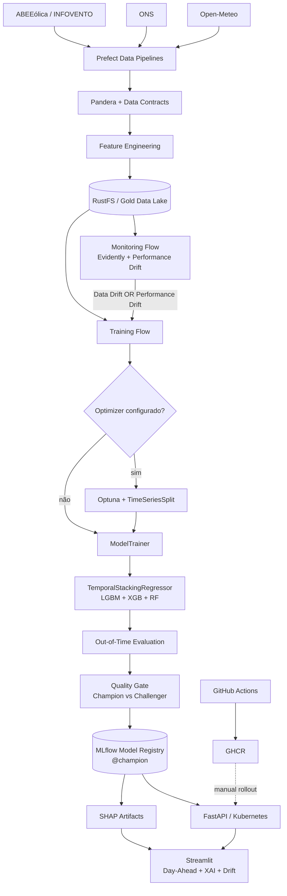
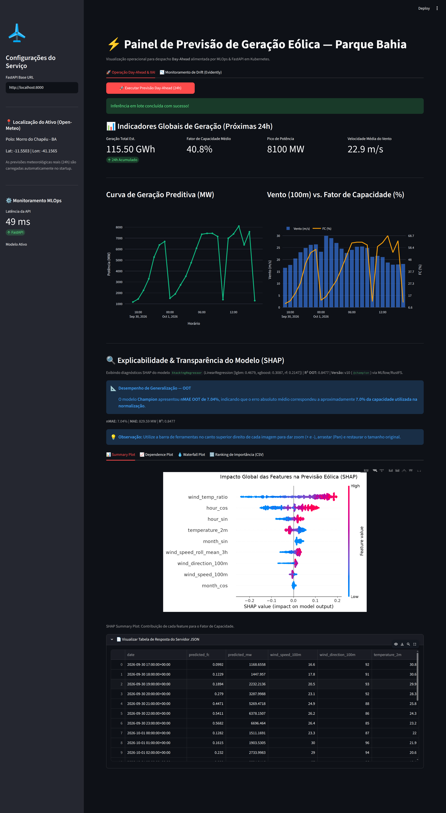
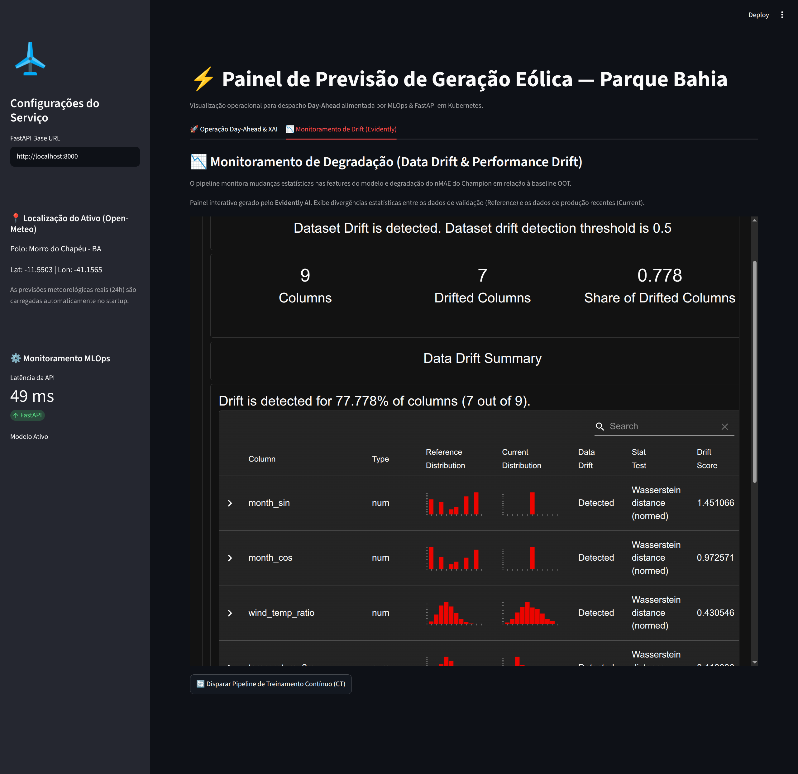

# Renewable Energy MLOps — Wind Power Forecasting

[](https://github.com/wanderson42/renewable-energy-mlops/releases/latest)
[](https://github.com/wanderson42/renewable-energy-mlops/actions/workflows/ci_cd.yaml)


[](LICENSE)

Sistema MLOps end-to-end para **previsão horária Day-Ahead de geração eólica na Bahia**, cobrindo ingestão de dados, contratos de features, validação temporal, otimização de hiperparâmetros, experiment tracking, Model Registry, explicabilidade, monitoramento de drift, Continuous Training, model serving e operação local em Kubernetes.

O modelo aprende o **fator de capacidade (`target_fc`)** e reconstrói a previsão operacional em MW usando a capacidade disponível. O foco do projeto não é apenas treinar um regressor, mas preservar contratos consistentes entre **dados → treinamento → registry → serving → monitoring → retraining**.

> **Escopo:** projeto educacional e de portfólio. O repositório demonstra práticas de engenharia e MLOps; não deve ser interpretado como sistema certificado para decisões reais de despacho energético.

## Visão geral



### Dois lifecycles distintos

O projeto separa explicitamente:

- **Software lifecycle:** `push → GitHub Actions → tox → Docker build → GHCR → rollout Kubernetes manual`.
- **Model lifecycle:** `Monitoring → CT → Challenger → Quality Gate → @champion → hot reload`.

Treinar um novo modelo não implica publicar uma nova imagem, e publicar uma nova imagem da API não implica retreinar o modelo.

## Estado atual — 2026-10-02

| Item | Estado |
|---|---|
| Modelo registrado | `ensemble_lgb_xgb_rf_bahia` |
| Alias operacional | `@champion` |
| Champion | **v10** |
| OOT MAE | **829.59 MW** |
| OOT nMAE | **7.04%** |
| OOT R² | **0.8477** |
| Features do modelo | **9** |
| Último Challenger | **v12 — rejeitado pelo Quality Gate** |
| Data Drift observado | **7/9 features (77.8%)** |
| Threshold de Data Drift | **50%** |
| Testes automatizados | **129 passed / 0 failed** |
| Warnings conhecidos | **2 — Evidently/NumPy, não bloqueantes** |

O Challenger v12 apresentou `837.85 MW` de MAE OOT, `7.11%` de nMAE e `R² = 0.8438`. Como não melhorou o MAE e não reduziu o número de features, o alias `@champion` permaneceu na v10.

### Experimento de simplificação — v0.2.0

O experimento v0.2.0 avaliou três arquiteturas sobre **o mesmo snapshot temporal congelado**, com 21.425 observações de treino, 720 observações OOT de setembro/2026, 9 features, 20 trials Optuna, 3 splits externos e 5 splits internos do Stacking.

| Arquitetura | OOT MAE (MW) | OOT nMAE (%) | OOT R² |
|---|---:|---:|---:|
| LGBM + XGB + RF | **774.90** | **6.57** | **0.8666** |
| LGBM + RF | 788.35 | 6.69 | 0.8633 |
| LGBM + XGB | 785.31 | 6.66 | 0.8641 |

A hipótese original de remover o XGBoost não foi sustentada no novo snapshot. `LGBM + XGB` foi o melhor candidato reduzido, mas o ensemble completo manteve os melhores valores pontuais no OOT.

O benchmark é tratado como **evidência experimental** e não promoveu automaticamente nenhum modelo. O Champion operacional permanece na v10, pois suas métricas históricas pertencem a outro período OOT e não são comparadas diretamente com o benchmark v0.2.0 para fins de promoção.


### Experimento de janela temporal de treinamento

Após o benchmark de simplificação, um segundo experimento manteve fixa a arquitetura
`LGBM + XGB + RF` e alterou apenas a quantidade de histórico disponível para o TRAIN.

Foram comparadas três políticas:

```text
Expanding
Rolling 24 meses
Rolling 12 meses
```

O contrato experimental permaneceu fixo em 9 features, OOT de setembro/2026,
20 trials Optuna, 3 splits externos e 5 splits internos do Stacking.

| Janela | TRAIN rows | CV nMAE mean (%) | CV nMAE std (%) | OOT MAE (MW) | OOT nMAE (%) | OOT R² |
|---|---:|---:|---:|---:|---:|---:|
| Expanding | 21,425 | 8.6949 | 0.6791 | **787.18** | **6.6788** | **0.8614** |
| Rolling 24m | 17,486 | 9.1920 | 1.6572 | 937.14 | 7.9511 | 0.8217 |
| Rolling 12m | 8,760 | **8.1086** | 0.8133 | 889.66 | 7.5483 | 0.8297 |

Para este snapshot e este holdout futuro, a **Expanding Window** apresentou o melhor
desempenho OOT. O Rolling 12m obteve o menor nMAE médio na validação interna, mas essa
vantagem não se transferiu para o OOT, reforçando a necessidade de avaliar CV temporal
e holdout futuro separadamente.

A conclusão é contextual: o resultado não demonstra superioridade universal da
Expanding Window. A política passou a ser parametrizável por `training_window_months`
para permitir repetição do benchmark em novos períodos OOT.

A evidência detalhada está em
[`notebooks/experiments/training_window_comparison_benchmark.ipynb`](notebooks/experiments/training_window_comparison_benchmark.ipynb).


## Dashboard operacional

### Day-Ahead Forecasting & Explainability



A interface consome previsão meteorológica real da Open-Meteo para **Morro do Chapéu - BA**, executa inferência em lote via FastAPI e exibe indicadores de geração, curvas horárias, metadados do Champion e explicabilidade SHAP vinculada ao `run_id` efetivamente servido.

### Monitoring — Data Drift & Performance Drift



O relatório do Evidently monitora apenas as features pertencentes ao contrato do modelo. Data Drift e Performance Drift são avaliados separadamente; qualquer um deles pode disparar Continuous Training, mas **drift nunca promove um modelo diretamente**.

## Proveniência dos dados

O contrato atual separa claramente as fontes:

- **meteorologia:** Open-Meteo;
- **geração eólica horária:** ONS;
- **capacidade instalada canônica:** checkpoints históricos da ABEEólica / INFOVENTO;
- **ANEEL:** fonte diagnóstica para reconciliação de eventos, não usada para reconstruir `capacidade_mw`.

A capacidade é aplicada causalmente: cada timestamp utiliza somente o checkpoint mais recente já disponível. Não são usados interpolação linear nem backward fill. O histórico canônico de capacidade utilizado na v0.2.0 começa em **2024-03-21**.

Na extração do ONS, horas com registros incompletos de geração são descartadas antes da agregação estadual; valores ausentes de usinas não são transformados em `0 MW`.

## Arquitetura de modelagem

O modelo operacional usa `TemporalStackingRegressor` com OOF causal:

```text
LightGBM ───┐
XGBoost ────┼──> OOF temporal ──> LinearRegression
RandomForest┘                    positive=True
                                  fit_intercept=False
```

A validação usa `TimeSeriesSplit`. O bloco inicial que não possui previsão OOF é excluído do treinamento do meta-learner; depois, os modelos base são refitados sobre todo o conjunto de treino disponível.

Na v0.2.0, os estimadores base passaram a ser configuráveis para suportar ablações controladas (`LGBM + XGB + RF`, `LGBM + RF` e `LGBM + XGB`) sem duplicar trainers. Essa flexibilidade serve ao experimento; a arquitetura operacional continua sendo o stack completo enquanto não houver uma decisão explícita de lifecycle.

### Contrato canônico de features

A seleção das features é centralizada por `ModelFeatureSchema`; otimização, treinamento, serving e monitoring não mantêm listas paralelas.

```text
temperature_2m
wind_speed_100m
wind_direction_100m
wind_temp_ratio
hour_sin
hour_cos
month_sin
month_cos
wind_speed_roll_mean_3h
```

A rolling de vento de 3 horas é construída de forma causal e **gap-safe**, usando uma janela cronológica de três horas em vez das três linhas anteriores. Isso evita leakage temporal e impede que a feature atravesse artificialmente grandes lacunas do dataset.

### Métricas canônicas

Novas Runs MLflow registram:

```text
oot_mae_mw
oot_nmae_pct
oot_mae_fc_pct
oot_r2_score
```

O ano não faz parte do nome das métricas. Runs históricas podem ser lidas por uma camada de compatibilidade `_<YYYY>` enquanto ainda houver modelos operacionais antigos que dependam dela.

## Continuous Training e Quality Gate

O orquestrador Prefect é agnóstico em relação ao algoritmo de treinamento:

```text
optimizer_name="stacking"
        ↓
Optuna → best_params → trainer

optimizer_name="none"
        ↓
pula a otimização
        ↓
trainer recebe None / None
```

Cada `ModelTrainer` decide se otimização é obrigatória. O Stacking atual exige `best_params` e `optimization_run_id`; `train_examples.py` demonstra um Ridge compatível com execução sem optimizer.

A promoção de Challenger para Champion só ocorre após o **Quality Gate**. Na execução E2E validada, o Monitoring detectou drift, o CT treinou a v12 e o gate decidiu manter a v10. Não promover também é um resultado esperado de governança.

A regra atual de parcimônia considera **redução do número de features**, não redução do número de estimadores base. Por isso, ela não foi usada para decidir automaticamente entre as arquiteturas do experimento v0.2.0, que compartilham o mesmo contrato de 9 features.


A política de construção do TRAIN também é explícita:

```text
training_window_months=None  -> Expanding
training_window_months=24    -> Rolling 24m
training_window_months=12    -> Rolling 12m
```

A escolha da janela é uma configuração experimental/de treinamento e não constitui,
por si só, um critério de promoção no Quality Gate.

## Persistência e resiliência local

O MLflow separa estado persistente em dois backends:

```text
MLflow metadata  -> PostgreSQL -> postgres-pvc
MLflow artifacts -> RustFS     -> rustfs-pvc
```

A persistência foi validada de forma controlada após restart individual dos deployments
de PostgreSQL e RustFS e também após restart do container `energy-mlops-control-plane`.
A mesma Run canary manteve parâmetros, métricas e artifact acessíveis após a recuperação.

A investigação também mostrou que a falha observada durante um benchmark longo não era
perda de dados, mas indisponibilidade do `kubectl port-forward`. Por isso, os dois
endpoints críticos ao tracking e aos artifacts locais passaram a usar um supervisor
com retry automático:

```text
localhost:5000 -> MLflow
localhost:9000 -> RustFS API
```

O escopo validado cobre reinícios de pods, deployments e do container control-plane do
KinD. Ele **não** implica durabilidade após deleção de PVC, `kind delete cluster`,
perda do disco do host ou perda da máquina.

A arquitetura, a configuração e a matriz completa de validação estão em
[`docs/INFRASTRUCTURE.md`](docs/INFRASTRUCTURE.md).

## Stack técnico

| Camada | Tecnologias |
|---|---|
| Linguagem / ambiente | Python 3.14, Poetry 2.x |
| Dados | pandas, PyArrow, Open-Meteo, ONS, ABEEólica / INFOVENTO |
| Contratos | Pandera, Pydantic |
| Modelagem | scikit-learn, LightGBM, XGBoost, Random Forest |
| Ensemble temporal | `TemporalStackingRegressor`, `TimeSeriesSplit` |
| Otimização | Optuna |
| Experiment tracking | MLflow |
| Explainability | SHAP |
| Orquestração | Prefect 3 |
| Monitoring | Evidently 0.7+ |
| Object Storage | RustFS, API compatível com S3 |
| Metadata store | PostgreSQL |
| Serving | FastAPI |
| Dashboard | Streamlit + Plotly |
| Containers | Docker, GHCR |
| Kubernetes local | KinD + Helm |
| Qualidade | pytest, Tox, Ruff |
| CI | GitHub Actions |

## Estrutura do repositório

```text
renewable-energy-mlops/
├── .github/
│   └── workflows/
│       └── ci_cd.yaml                         # CI: testes, build e publicação da imagem no GHCR
├── docs/
│   ├── INFRASTRUCTURE.md                     # Arquitetura local, persistência, configuração e resiliência
│   ├── MODEL_CARD.md                         # Contrato, métricas, limitações e governança do modelo
│   └── OPERATIONS.md                         # Runbook operacional: monitoring, CT, validação e rollout
├── helm/                                     # Infraestrutura Kubernetes local sobre KinD
│   ├── Chart.yaml                            # Metadados do Helm Chart
│   ├── values.yaml                           # Configuração pública/default dos serviços
│   └── templates/
│       ├── api.yaml                          # Deployment e Service do Model Serving FastAPI
│       ├── mlflow.yaml                       # MLflow Tracking Server e artifact store
│       ├── postgres.yaml                     # PostgreSQL e PVC do metadata store
│       └── rustfs.yaml                       # RustFS S3-compatible e PVC do Data Lake
├── notebooks/
│   ├── experiments/
│   │   ├── ensemble_simplification_v0_2_0.ipynb
│   │   │                                      # Benchmark controlado de simplificação do ensemble
│   │   └── training_window_comparison_benchmark.ipynb
│   │                                          # Expanding × Rolling 24m × Rolling 12m
│   ├── renewable-energy-mlops.ipynb          # Narrativa técnica curada e documentação central
│   ├── extract_test.png                      # Evidência visual auxiliar da extração
│   ├── streamlit_day_ahead.png               # Evidência visual do dashboard Day-Ahead
│   └── streamlit_monitoring.png              # Evidência visual do dashboard de monitoring
├── scripts/
│   └── port-forward-supervisor.sh            # Retry automático dos port-forwards críticos
├── src/
│   └── energy_mlops/
│       ├── app/
│       │   └── app.py                        # Aplicação/dashboard Streamlit
│       ├── data/
│       │   ├── build_features.py             # Integração dos dados e feature engineering
│       │   ├── extract_energy.py             # Extração e preparação da geração do ONS
│       │   ├── extract_weather.py            # Extração dos dados meteorológicos
│       │   ├── feature_utils.py              # Contrato e seleção das features do modelo
│       │   └── schema.py                     # Contratos Pandera dos dados
│       ├── models/
│       │   ├── interfaces.py                 # Interfaces de trainers e optimizers
│       │   ├── optimize_stacking_ensemble.py # Otimização temporal com Optuna
│       │   ├── temporal_stacking.py          # Stacking temporal com OOF causal
│       │   ├── train_examples.py             # Exemplos compatíveis com a interface genérica
│       │   └── train_stacking_ensemble.py    # Treino, métricas, SHAP e MLflow
│       ├── pipelines/
│       │   ├── backfill_flow.py              # Backfill histórico
│       │   ├── data_ingestion_flow.py        # Ingestão de novos dados
│       │   ├── monitoring_flow.py             # Drift, performance e gatilho de CT
│       │   ├── training_flow.py               # Otimização, treino e Quality Gate
│       │   └── utils.py                       # Utilitários compartilhados pelos flows
│       ├── service/
│       │   ├── main.py                        # API FastAPI e lifecycle do Champion
│       │   ├── schema.py                      # Contratos Pydantic da API
│       │   └── xai_artifacts.py               # Recuperação dos artifacts XAI
│       └── config.py                          # Pydantic Settings e conexões externas
├── tests/
│   ├── data/                                  # Features, schemas e causalidade temporal
│   ├── infra/
│   │   └── test_port_forward_supervisor.py   # Retry, argumentos e encerramento seguro do supervisor
│   ├── models/                                # Stacking, optimizer e treinamento
│   ├── pipelines/                             # Flows, monitoring e Quality Gate
│   ├── service/                               # API, serving e XAI
│   ├── conftest.py                            # Fixtures compartilhadas
│   └── test_config.py                         # Contrato central de configuração
├── CITATION.cff                              # Metadados de citação do repositório
├── Dockerfile                                # Imagem do serviço FastAPI
├── LICENSE                                   # Licença MIT
├── Makefile                                  # Automação de serviços, portas, testes e validação
├── pyproject.toml                            # Dependências Poetry e ferramentas
├── poetry.lock                               # Lockfile reproduzível do ambiente Python
├── tox.ini                                   # Suíte isolada de qualidade
└── README.md                                 # Landing page e Quick Start
```

Datasets Parquet reais, secrets, logs, caches, banco SQLite auxiliar, outputs locais de SHAP e evidências E2E não fazem parte do repositório publicado.

## Quick Start

### Pré-requisitos

- Python **3.14**
- Poetry **2.x**
- Docker
- `kubectl`
- Helm
- KinD

### Instalação do ambiente Python

```bash
git clone https://github.com/wanderson42/renewable-energy-mlops.git
cd renewable-energy-mlops

poetry install
cp .env.example .env
```

Preencha o `.env` local com as credenciais e endpoints do ambiente. Secrets reais não devem ser versionados.

### Operação do ambiente local

Com o cluster KinD e os workloads Helm provisionados:

```bash
make ports
make status
make validate
```

Serviços locais esperados:

| Serviço | Endpoint |
|---|---|
| RustFS API | `http://localhost:9000` |
| RustFS Console | `http://localhost:9001` |
| MLflow | `http://localhost:5000` |
| FastAPI | `http://localhost:8000` |
| Prefect | `http://127.0.0.1:4200` |
| Streamlit | `http://localhost:8501` |


Os port-forwards críticos de **MLflow (`5000`)** e **RustFS API (`9000`)** são
supervisionados por `scripts/port-forward-supervisor.sh`. Se o processo `kubectl`
encerrar por perda de conexão, o supervisor tenta restabelecer o túnel automaticamente.

Os logs dos port-forwards ficam separados em `.ports/`.

Para encerrar port-forwards e processos locais:

```bash
make stop-ports
```

O runbook completo está em [`docs/OPERATIONS.md`](docs/OPERATIONS.md).

A fase v1.0 já exercitou, em um KinD separado, provisionamento por Terraform/Helm,
restauração, serving pareado da v17 e recuperação declarativa de uma falha de
pull, com PVCs preservados e plano final sem mudanças. O runtime MLflow foi
empacotado, publicado no GHCR e validado no ensaio por digest, com Registry e
leitura/hash de artefato aprovados. `make repro-client` prepara Prefect e dashboard
em portas e estado próprios, usando o ambiente Poetry. O primeiro startup confirmou
SDKs, modelo e artefato; o operador informou que o dashboard funcionou. A correção
da autenticação vazia que afetou a UI Prefect aguarda validação no host.
O blueprint AWS segue em andamento. O escopo, as evidências
e os critérios de aceitação estão em
[`docs/REPRODUCIBLE_DEPLOYMENT.md`](docs/REPRODUCIBLE_DEPLOYMENT.md).

## Principais endpoints da API

```text
GET  /health
GET  /model-info
POST /predict/batch
POST /reload-model
```

`/model-info` expõe a identidade da versão servida e suas métricas canônicas. O Dashboard usa esse `run_id` para recuperar os artefatos XAI da mesma Run, evitando divergência entre previsão e explicabilidade.

## Monitoring

Execução manual do fluxo:

```bash
poetry run python -m energy_mlops.pipelines.monitoring_flow
```

Regras atuais:

```text
Data Drift threshold        = 50% das features
Performance Drift threshold = +2.0 p.p. de nMAE
Trigger de CT               = Data Drift OR Performance Drift
```

O relatório HTML do Evidently é persistido antes da avaliação de Performance Drift para preservar evidência intermediária mesmo se uma etapa posterior falhar.

## Testes e qualidade

Validação consolidada:

```bash
poetry run tox -r -e py314
```

Resultado validado:

```text
129 passed
0 failed
2 warnings
py314: OK
```

Os warnings conhecidos são provenientes de compatibilidade interna Evidently/NumPy e não representam falhas da aplicação.

Checks adicionais:

```bash
poetry run ruff check src tests
git diff --check
```

O projeto **não declara percentual de cobertura**, pois coverage não foi medido nesta validação.

## CI/CD e deployment

O workflow em [`.github/workflows/ci_cd.yaml`](.github/workflows/ci_cd.yaml) executa a suíte de testes antes do build da imagem. Após sucesso, a imagem da FastAPI é publicada no **GitHub Container Registry (GHCR)**.

O deployment Kubernetes local é deliberadamente explícito e permanece manual, por exemplo:

```bash
kubectl rollout restart deployment/energy-api
kubectl rollout status deployment/energy-api
```

Portanto, o projeto possui **CI + entrega de imagem automatizada**, mas não se apresenta como GitOps completo.

## Reprodutibilidade e segurança

- `poetry.lock` fixa o ambiente Python reproduzível.
- `.env.example` documenta configuração sem carregar secrets reais.
- `helm/values_secrets.yaml` permanece local e ignorado pelo Git.
- Datasets reais não são versionados; o Data Lake operacional reside no RustFS.
- MLflow registra datasets, parâmetros, métricas, artifacts e lineage entre Optimization Run e Training Run.
- Experimentos controlados usam um snapshot Gold explícito e TRAIN/OOT derivados com corte temporal documentado, evitando leituras ambíguas por prefixo.
- `make status` é diagnóstico; `make validate` funciona como gate operacional.
- Unit tests isolam dependências externas quando a infraestrutura não faz parte do comportamento sob teste.
- PostgreSQL e RustFS usam PVCs separados para metadata e artifacts do MLflow.
- Persistência foi validada após restart de pods/deployments e do control-plane KinD.
- Os port-forwards críticos `5000` e `9000` possuem retry automático no ambiente local.

## Documentação técnica

O README funciona como landing page. A análise detalhada do projeto, decisões técnicas, experimentos, validação E2E e contratempos resolvidos estão no notebook:

**[`notebooks/renewable-energy-mlops.ipynb`](notebooks/renewable-energy-mlops.ipynb)**

Documentos adicionais:

- [`docs/MODEL_CARD.md`](docs/MODEL_CARD.md) — objetivo, contrato, métricas, limitações e governança do modelo.
- [`docs/INFRASTRUCTURE.md`](docs/INFRASTRUCTURE.md) — arquitetura local, persistência, configuração e resiliência.
- [`docs/OPERATIONS.md`](docs/OPERATIONS.md) — runbook local, validação, monitoring, CT e rollout.
- [`notebooks/experiments/ensemble_simplification_v0_2_0.ipynb`](notebooks/experiments/ensemble_simplification_v0_2_0.ipynb) — benchmark controlado de simplificação do ensemble.
- [`notebooks/experiments/training_window_comparison_benchmark.ipynb`](notebooks/experiments/training_window_comparison_benchmark.ipynb) — benchmark Expanding × Rolling 24m × Rolling 12m.

## Packaging scope

Este repositório é uma **aplicação/sistema MLOps**, não uma biblioteca Python de propósito geral. O pacote `energy_mlops` é instalado localmente pelo Poetry para organizar imports e testes, mas o projeto não é distribuído via PyPI.

Por isso não são necessários `setup.py`, `requirements.txt` redundante ou `MANIFEST.in` apenas para simular um pacote de distribuição. `pyproject.toml` + `poetry.lock` permanecem as fontes de verdade do ambiente Python da aplicação. O arquivo `docker/mlflow/requirements.txt` pertence ao runtime separado do servidor MLflow (Python 3.11), cujas versões foram verificadas e empacotadas em uma imagem própria.

## Limitações atuais

- O ambiente validado é local, baseado em KinD com deployment por Terraform/Helm no ensaio; o blueprint AWS permanece em desenvolvimento, sem deployment cloud.
- O nome atual do Registered Model (`ensemble_lgb_xgb_rf_bahia`) reflete a arquitetura histórica e poderá futuramente evoluir para um nome orientado ao produto.
- Compatibilidade com métricas históricas `*_YYYY` ainda é necessária enquanto modelos antigos permanecerem operacionalmente relevantes.
- A vantagem observada da Expanding Window foi medida em um OOT específico e precisa ser reavaliada longitudinalmente.
- Resultados de uma janela temporal não garantem comportamento idêntico em meses futuros; drift e performance precisam continuar sendo monitorados.
- A persistência foi validada para reinícios de pods/deployments e do container control-plane do KinD, não para deleção de PVC, `kind delete cluster` ou perda do host.
- O projeto é educacional e não substitui processos de validação, segurança e governança exigidos em operação energética real.

## Roadmap

- repetir o benchmark de janelas com novos meses OOT fechados para avaliar a estabilidade da vantagem observada da **Expanding Window**;
- reavaliar janelas mais longas somente quando houver histórico canônico suficiente de `capacidade_mw`;
- acompanhar longitudinalmente a estabilidade de `LGBM + XGB + RF` e `LGBM + XGB` em novos períodos OOT;
- definir uma política explícita de simplificação por número de estimadores apenas se isso se tornar necessário no lifecycle operacional;
- medir custo de treinamento, latência de inferência e tamanho dos artifacts quando esses fatores passarem a ser relevantes para a decisão arquitetural;
- evoluir o Registered Model para uma identidade orientada ao produto, independente da arquitetura;
- remover a compatibilidade de métricas `*_YYYY` quando nenhum modelo operacional relevante depender mais do contrato histórico;
- ampliar o ensaio de backup/restore já validado entre dois clusters KinD para outros cenários de recuperação, conforme necessário;
- criar blueprint IaC com Terraform para AWS, mantendo KinD + Helm como ambiente local reproduzível e a fase Cloud/IaC separada da evolução do modelo.

## Licença

O código-fonte deste repositório é disponibilizado sob a [MIT License](LICENSE).

A licença MIT aplica-se ao código desenvolvido neste repositório. **Datasets, APIs, bibliotecas, imagens e serviços de terceiros permanecem sujeitos aos seus próprios termos e licenças.**

## Citação

O repositório inclui [`CITATION.cff`](CITATION.cff). Em interfaces compatíveis do GitHub, ele habilita a opção **Cite this repository**.

## Autor

**Wanderson Ferreira**

Projeto de portfólio em Machine Learning Engineering / MLOps com foco em previsão de energia renovável, séries temporais e lifecycle operacional de modelos.
