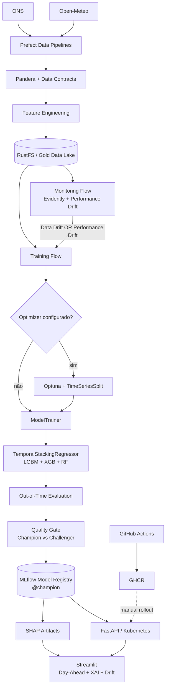

# Renewable Energy MLOps — Wind Power Forecasting

[](https://github.com/wanderson42/renewable-energy-mlops/actions/workflows/ci_cd.yaml)


Sistema MLOps end-to-end para **previsão horária Day-Ahead de geração eólica na Bahia**, cobrindo ingestão de dados, contratos de features, validação temporal, otimização de hiperparâmetros, experiment tracking, Model Registry, explicabilidade, monitoramento de drift, Continuous Training, model serving e operação local em Kubernetes.

O modelo aprende o **fator de capacidade (`target_fc`)** e reconstrói a previsão operacional em MW usando a capacidade disponível. O foco do projeto não é apenas treinar um regressor, mas preservar contratos consistentes entre **dados → treinamento → registry → serving → monitoring → retraining**.

> **Escopo:** projeto educacional e de portfólio. O repositório demonstra práticas de engenharia e MLOps; não deve ser interpretado como sistema certificado para decisões reais de despacho energético.

## Visão geral



### Dois lifecycles distintos

O projeto separa explicitamente:

- **Software lifecycle:** `push → GitHub Actions → tox → Docker build → GHCR → rollout Kubernetes manual`.
- **Model lifecycle:** `Monitoring → CT → Challenger → Quality Gate → @champion → hot reload`.

Treinar um novo modelo não implica publicar uma nova imagem, e publicar uma nova imagem da API não implica retreinar o modelo.

## Snapshot validado — 2026-09-30

| Item | Estado |
|---|---|
| Modelo registrado | `ensemble_lgb_xgb_rf_bahia` |
| Alias operacional | `@champion` |
| Champion | **v10** |
| OOT MAE | **829.59 MW** |
| OOT nMAE | **7.04%** |
| OOT R² | **0.8477** |
| Features do modelo | **9** |
| Último Challenger | **v12 — rejeitado pelo Quality Gate** |
| Data Drift observado | **7/9 features (77.8%)** |
| Threshold de Data Drift | **50%** |
| Testes automatizados | **75 passed / 0 failed** |
| Warnings conhecidos | **2 — Evidently/NumPy, não bloqueantes** |

O Challenger v12 apresentou `837.85 MW` de MAE OOT, `7.11%` de nMAE e `R² = 0.8438`. Como não melhorou o MAE e não reduziu o número de features, o alias `@champion` permaneceu na v10.

## Dashboard operacional

### Day-Ahead Forecasting & Explainability


A interface consome previsão meteorológica real da Open-Meteo para **Morro do Chapéu - BA**, executa inferência em lote via FastAPI e exibe indicadores de geração, curvas horárias, metadados do Champion e explicabilidade SHAP vinculada ao `run_id` efetivamente servido.

### Monitoring — Data Drift & Performance Drift


O relatório do Evidently monitora apenas as features pertencentes ao contrato do modelo. Data Drift e Performance Drift são avaliados separadamente; qualquer um deles pode disparar Continuous Training, mas **drift nunca promove um modelo diretamente**.

## Arquitetura de modelagem

O modelo operacional usa `TemporalStackingRegressor` com OOF causal:

```text
LightGBM ───┐
XGBoost ────┼──> OOF temporal ──> LinearRegression
RandomForest┘                    positive=True
                                  fit_intercept=False
```

A validação usa `TimeSeriesSplit`. O bloco inicial que não possui previsão OOF é excluído do treinamento do meta-learner; depois, os modelos base são refitados sobre todo o conjunto de treino disponível.

### Contrato canônico de features

A seleção das features é centralizada por `ModelFeatureSchema`; otimização, treinamento, serving e monitoring não mantêm listas paralelas.

```text
temperature_2m
wind_speed_100m
wind_direction_100m
wind_temp_ratio
hour_sin
hour_cos
month_sin
month_cos
wind_speed_roll_mean_3h
```

A rolling de vento de 3 horas é construída de forma causal para evitar leakage temporal.

### Métricas canônicas

Novas Runs MLflow registram:

```text
oot_mae_mw
oot_nmae_pct
oot_mae_fc_pct
oot_r2_score
```

O ano não faz parte do nome das métricas. Runs históricas podem ser lidas por uma camada de compatibilidade `_<YYYY>` enquanto ainda houver modelos operacionais antigos que dependam dela.

## Continuous Training e Quality Gate

O orquestrador Prefect é agnóstico em relação ao algoritmo de treinamento:

```text
optimizer_name="stacking"
        ↓
Optuna → best_params → trainer

optimizer_name="none"
        ↓
pula a otimização
        ↓
trainer recebe None / None
```

Cada `ModelTrainer` decide se otimização é obrigatória. O Stacking atual exige `best_params` e `optimization_run_id`; `train_examples.py` demonstra um Ridge compatível com execução sem optimizer.

A promoção de Challenger para Champion só ocorre após o **Quality Gate**. Na execução E2E validada, o Monitoring detectou drift, o CT treinou a v12 e o gate decidiu manter a v10. Não promover também é um resultado esperado de governança.

## Stack técnico

| Camada | Tecnologias |
|---|---|
| Linguagem / ambiente | Python 3.14, Poetry 2.x |
| Dados | pandas, PyArrow, Open-Meteo, ONS |
| Contratos | Pandera, Pydantic |
| Modelagem | scikit-learn, LightGBM, XGBoost, Random Forest |
| Ensemble temporal | `TemporalStackingRegressor`, `TimeSeriesSplit` |
| Otimização | Optuna |
| Experiment tracking | MLflow |
| Explainability | SHAP |
| Orquestração | Prefect 3 |
| Monitoring | Evidently 0.7+ |
| Object Storage | RustFS, API compatível com S3 |
| Metadata store | PostgreSQL |
| Serving | FastAPI |
| Dashboard | Streamlit + Plotly |
| Containers | Docker, GHCR |
| Kubernetes local | KinD + Helm |
| Qualidade | pytest, Tox, Ruff |
| CI | GitHub Actions |

## Estrutura do repositório

```text
renewable-energy-mlops/
├── .github/workflows/ci_cd.yaml
├── docs/
│   ├── MODEL_CARD.md
│   └── OPERATIONS.md
├── helm/
│   ├── Chart.yaml
│   ├── values.yaml
│   └── templates/
│       ├── api.yaml
│       ├── mlflow.yaml
│       ├── postgres.yaml
│       └── rustfs.yaml
├── notebooks/
│   ├── extract_test.png
│   ├── renewable-energy-mlops.ipynb
│   ├── streamlit_day_ahead.png
│   └── streamlit_monitoring.png
├── src/energy_mlops/
│   ├── app/app.py
│   ├── data/
│   │   ├── build_features.py
│   │   ├── extract_energy.py
│   │   ├── extract_weather.py
│   │   ├── feature_utils.py
│   │   └── schema.py
│   ├── models/
│   │   ├── interfaces.py
│   │   ├── optimize_stacking_ensemble.py
│   │   ├── temporal_stacking.py
│   │   ├── train_examples.py
│   │   └── train_stacking_ensemble.py
│   ├── pipelines/
│   │   ├── backfill_flow.py
│   │   ├── data_ingestion_flow.py
│   │   ├── monitoring_flow.py
│   │   ├── training_flow.py
│   │   └── utils.py
│   ├── service/
│   │   ├── main.py
│   │   ├── schema.py
│   │   └── xai_artifacts.py
│   └── config.py
├── tests/
│   ├── data/
│   ├── models/
│   ├── pipelines/
│   └── service/
├── CITATION.cff
├── Dockerfile
├── LICENSE
├── Makefile
├── pyproject.toml
├── poetry.lock
├── tox.ini
└── README.md
```

Datasets Parquet reais, secrets, logs, caches, banco SQLite auxiliar, outputs locais de SHAP e evidências E2E não fazem parte do repositório publicado.

## Quick Start

### Pré-requisitos

- Python **3.14**
- Poetry **2.x**
- Docker
- `kubectl`
- Helm
- KinD

### Instalação do ambiente Python

```bash
git clone https://github.com/wanderson42/renewable-energy-mlops.git
cd renewable-energy-mlops

poetry install
cp .env.example .env
```

Preencha o `.env` local com as credenciais e endpoints do ambiente. Secrets reais não devem ser versionados.

### Operação do ambiente local

Com o cluster KinD e os workloads Helm provisionados:

```bash
make ports
make status
make validate
```

Serviços locais esperados:

| Serviço | Endpoint |
|---|---|
| RustFS API | `http://localhost:9000` |
| RustFS Console | `http://localhost:9001` |
| MLflow | `http://localhost:5000` |
| FastAPI | `http://localhost:8000` |
| Prefect | `http://127.0.0.1:4200` |
| Streamlit | `http://localhost:8501` |

Para encerrar port-forwards e processos locais:

```bash
make stop-ports
```

O runbook completo está em [`docs/OPERATIONS.md`](docs/OPERATIONS.md).

## Principais endpoints da API

```text
GET  /health
GET  /model-info
POST /predict/batch
POST /reload-model
```

`/model-info` expõe a identidade da versão servida e suas métricas canônicas. O Dashboard usa esse `run_id` para recuperar os artefatos XAI da mesma Run, evitando divergência entre previsão e explicabilidade.

## Monitoring

Execução manual do fluxo:

```bash
poetry run python -m energy_mlops.pipelines.monitoring_flow
```

Regras atuais:

```text
Data Drift threshold        = 50% das features
Performance Drift threshold = +2.0 p.p. de nMAE
Trigger de CT               = Data Drift OR Performance Drift
```

O relatório HTML do Evidently é persistido antes da avaliação de Performance Drift para preservar evidência intermediária mesmo se uma etapa posterior falhar.

## Testes e qualidade

Validação consolidada:

```bash
poetry run tox -r -e py314
```

Resultado validado:

```text
75 passed
0 failed
2 warnings
py314: OK
```

Os warnings conhecidos são provenientes de compatibilidade interna Evidently/NumPy e não representam falhas da aplicação.

Checks adicionais:

```bash
poetry run ruff check src tests
git diff --check
```

O projeto **não declara percentual de cobertura**, pois coverage não foi medido nesta validação.

## CI/CD e deployment

O workflow em [`.github/workflows/ci_cd.yaml`](.github/workflows/ci_cd.yaml) executa a suíte de testes antes do build da imagem. Após sucesso, a imagem da FastAPI é publicada no **GitHub Container Registry (GHCR)**.

O deployment Kubernetes local é deliberadamente explícito e permanece manual, por exemplo:

```bash
kubectl rollout restart deployment/energy-api
kubectl rollout status deployment/energy-api
```

Portanto, o projeto possui **CI + entrega de imagem automatizada**, mas não se apresenta como GitOps completo.

## Reprodutibilidade e segurança

- `poetry.lock` fixa o ambiente Python reproduzível.
- `.env.example` documenta configuração sem carregar secrets reais.
- `helm/values_secrets.yaml` permanece local e ignorado pelo Git.
- Datasets reais não são versionados; o Data Lake operacional reside no RustFS.
- MLflow registra datasets, parâmetros, métricas, artifacts e lineage entre Optimization Run e Training Run.
- `make status` é diagnóstico; `make validate` funciona como gate operacional.
- Unit tests isolam dependências externas quando a infraestrutura não faz parte do comportamento sob teste.

## Documentação técnica

O README funciona como landing page. A análise detalhada do projeto, decisões técnicas, experimentos, validação E2E e contratempos resolvidos estão no notebook:

**[`notebooks/renewable-energy-mlops.ipynb`](notebooks/renewable-energy-mlops.ipynb)**

Documentos adicionais:

- [`docs/MODEL_CARD.md`](docs/MODEL_CARD.md) — objetivo, contrato, métricas, limitações e governança do modelo.
- [`docs/OPERATIONS.md`](docs/OPERATIONS.md) — runbook local, validação, monitoring, CT e rollout.

## Packaging scope

Este repositório é uma **aplicação/sistema MLOps**, não uma biblioteca Python de propósito geral. O pacote `energy_mlops` é instalado localmente pelo Poetry para organizar imports e testes, mas o projeto não é distribuído via PyPI.

Por isso não são necessários `setup.py`, `requirements.txt` redundante ou `MANIFEST.in` apenas para simular um pacote de distribuição. `pyproject.toml` + `poetry.lock` permanecem as fontes de verdade do ambiente Python.

## Limitações atuais

- O ambiente validado é local, baseado em KinD; a migração para cloud/IaC ainda é roadmap.
- O nome atual do Registered Model (`ensemble_lgb_xgb_rf_bahia`) reflete a arquitetura histórica e poderá futuramente evoluir para um nome orientado ao produto.
- Compatibilidade com métricas históricas `*_YYYY` ainda é necessária enquanto modelos antigos permanecerem operacionalmente relevantes.
- Resultados de uma janela temporal não garantem comportamento idêntico em meses futuros; drift e performance precisam continuar sendo monitorados.
- O projeto é educacional e não substitui processos de validação, segurança e governança exigidos em operação energética real.

## Roadmap

- comparar janelas rolling de **12 / 24 / 36 meses** com a janela expansiva sobre o mesmo holdout futuro;
- comparar `LightGBM + RandomForest` com o stack completo, motivado pelo peso zero do XGBoost na última execução;
- acompanhar drift e performance longitudinalmente ao longo de novos meses;
- evoluir o Registered Model para uma identidade orientada ao produto, independente da arquitetura;
- criar blueprint IaC com Terraform para AWS, mantendo KinD + Helm como ambiente local reproduzível.

## Licença

O código-fonte deste repositório é disponibilizado sob a [MIT License](LICENSE).

A licença MIT aplica-se ao código desenvolvido neste repositório. **Datasets, APIs, bibliotecas, imagens e serviços de terceiros permanecem sujeitos aos seus próprios termos e licenças.**

## Citação

O repositório inclui [`CITATION.cff`](CITATION.cff). Em interfaces compatíveis do GitHub, ele habilita a opção **Cite this repository**.

## Autor

**Wanderson Ferreira**

Projeto de portfólio em Machine Learning Engineering / MLOps com foco em previsão de energia renovável, séries temporais e lifecycle operacional de modelos.
