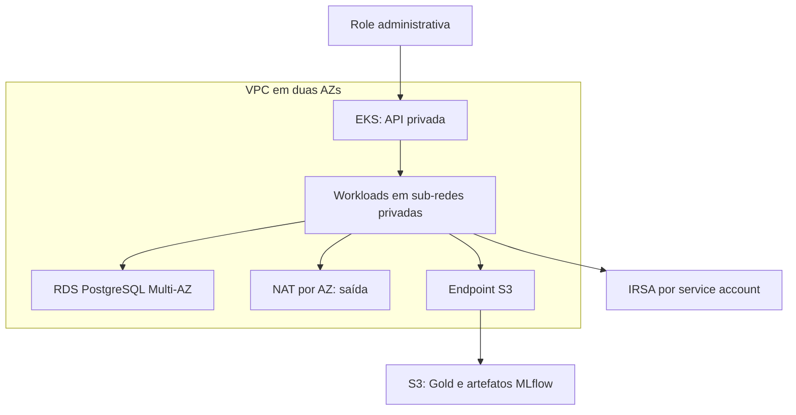

# AWS — blueprint IaC da v1.0

Este documento descreve a arquitetura declarada em
[`terraform/environments/aws`](../terraform/environments/aws). Não houve criação
de recursos AWS, plano autenticado ou deployment da aplicação na nuvem. O sistema
executável e validado permanece no KinD, conforme o
[runbook de reprodução](REPRODUCIBLE_DEPLOYMENT.md).

## Decisão e escopo

O projeto de portfólio não exige gasto cloud. Mantemos duas evidências distintas:
deployment local real, com estado e inferência reproduzidos, e blueprint AWS
verificado por configuração, análise estática e testes com provider simulado.
Os mocks não verificam quotas, permissões reais, disponibilidade regional,
compatibilidade entre versões, conectividade ou capacidade de provisionamento.

Os arquivos são separados por responsabilidade no mesmo root Terraform. Não
existem ambientes repetidos que justifiquem cinco módulos ou dependências em
módulos de terceiros neste momento. Uma extração futura deve ter um consumidor
concreto.

| Arquivo | Responsabilidade |
|---|---|
| `versions.tf` | Terraform/provider fixos, conta permitida e state separado |
| `variables.tf` | Entradas explícitas e validação de contratos |
| `network.tf` | VPC, seis sub-redes, rotas, NAT por AZ e endpoint S3 |
| `eks.tf` | Cluster, acesso administrativo, nodes e add-ons |
| `storage.tf` | Buckets de dados/artefatos, versões, TLS e acesso privado |
| `database.tf` | RDS PostgreSQL, isolamento, backup e credencial gerenciada |
| `iam.tf` | Roles de infraestrutura e IRSA por workload |
| `outputs.tf` | Contrato de integração para um eventual deployment |
| `tests/blueprint.tftest.hcl` | Fixtures fictícias e testes sem chamadas AWS |

## Arquitetura proposta



O endpoint do Kubernetes é privado por padrão. A operação precisaria de uma
conexão à VPC ou de um executor nela. Como opção explícita, uma lista IPv4
restrita (/24 ou mais estreita) pode habilitar o endpoint público administrativo.
Isso não publica FastAPI, MLflow, Prefect ou dashboard. Nenhum ingress ou load
balancer de aplicação é criado.

As duas sub-redes públicas servem aos NAT Gateways. Nodes e pods usam duas
sub-redes privadas; o banco usa outras duas, com rota apenas local à VPC.
O endpoint gateway S3 evita usar NAT para tráfego S3. NAT continua previsto para
saída necessária, incluindo pull do GHCR; não se afirma isolamento completo de
egress. Não há SSH aberto.

São declarados dois nodes `t3.large` ON_DEMAND, discos gp3 criptografados e IMDSv2
com hop limit 1. As roles dos pods são separadas da role dos nodes. O CNI tem sua
própria role IRSA. CoreDNS, kube-proxy e VPC CNI têm versões fornecidas
explicitamente. Não há autoscaler instalado: máximo 3 no node group é um limite
de configuração, não uma promessa de escala automática.

O cluster exporta logs de controle/auditoria com retenção de 30 dias. RDS usa
Multi-AZ, armazenamento criptografado, backup de sete dias, proteção de deleção e
snapshot final obrigatório. PostgreSQL 5432 aceita o security group do EKS; essa
regra autoriza o conjunto de nodes/pods desse grupo, não somente o pod MLflow.
NetworkPolicies/security groups por pod seriam uma decisão adicional.

Os buckets usam nomes globalmente distintos com projeto/ambiente/conta, bloqueio
de acesso público, ownership do bucket, SSE-S3, versionamento e rejeição de HTTP.
Uploads multipart incompletos expiram em sete dias. Versões de modelos/dados não
expiram automaticamente; retenção precisa de decisão de governança.
`prevent_destroy` e `force_destroy=false` preservam os buckets. Versionamento
não é uma política completa de backup externo.

## Identidade e autenticação

| Identidade | Permissões declaradas |
|---|---|
| Admin existente | Access Entry EKS e política administrativa de cluster |
| Cluster | Política gerenciada EKS Cluster |
| Nodes | EKS Worker e pull ECR; sem permissões S3 da aplicação |
| `kube-system/aws-node` | Política CNI, via IRSA |
| `energy-mlops/mlflow` | Leitura/escrita no bucket de artefatos e leitura do secret RDS |
| `energy-mlops/energy-api` | Leitura dos buckets Gold/artefatos |
| `energy-mlops/energy-pipelines` | Leitura/escrita nos buckets Gold/artefatos |

As trust policies IRSA vinculam audience `sts.amazonaws.com`, namespace e nome
exato da service account. O namespace é configurável; os nomes das contas saem
nos outputs. Roles IAM não criam service accounts Kubernetes: sua associação
precisa ser implementada no perfil Helm cloud.

O RDS gerencia sua senha no Secrets Manager; não há senha literal ou variável de
senha no HCL. A saída contém o ARN, não o valor. Ainda faltam a materialização e
rotação da credencial no pod, a configuração de usuário de aplicação com menor
privilégio e a distribuição do certificado CA para `sslmode=verify-full`.
Conceder `GetSecretValue` não implementa esses comportamentos.

Não reutilizar credenciais estáticas RustFS na AWS. O uso real deverá permitir a
cadeia padrão de credenciais AWS nos SDKs, com IRSA, e remover endpoints S3
locais. A configuração atual da aplicação/Helm ainda precisa dessa adaptação.
IRSA protege o acesso às APIs AWS; não autentica clientes HTTP da FastAPI,
MLflow ou Prefect. Esses serviços ficam sem exposição pública neste blueprint.

O state local AWS tem caminho separado do state KinD, em `.repro/aws.tfstate`.
Ele atende apenas a organização do blueprint. Um uso cloud real exige backend
remoto com acesso restrito, criptografia, versionamento e locking, preparado
separadamente antes de aplicar. State e planos brutos não devem entrar no Git.

## Validação gratuita

Terraform é uma CLI de infraestrutura, instalada em `.repro/bin` pelo target
existente `make repro-tools`. Ele não é instalado dentro do Poetry. O cliente
Python permanece gerenciado pelo `poetry.lock`.

```bash
make repro-tools       # somente se o binário ainda não estiver instalado
make aws-blueprint-check
```

O target executa apenas:

```bash
.repro/bin/terraform -chdir=terraform/environments/aws fmt -check -recursive
.repro/bin/terraform -chdir=terraform/environments/aws init -backend=false -input=false -lockfile=readonly
.repro/bin/terraform -chdir=terraform/environments/aws validate
.repro/bin/terraform -chdir=terraform/environments/aws test
```

`init` pode baixar o provider e depende de internet. `test` usa
`mock_provider "aws"`, e cada run usa `command = plan`: nenhum plano autenticado
ou apply AWS é executado. As AZs, conta, ARN e versões nas fixtures são dados de
teste; não são uma receita de deployment. Um plano normal sem mocks exige
credenciais e entradas verificadas na conta/região alvo.

O CI mantém os checks do ambiente local e adiciona a validação do blueprint.
A análise estática também verifica regras de lint e controles de segurança
explicitamente selecionados; não substitui revisão de arquitetura ou auditoria
completa.

## Fronteiras ainda não exercitadas

O [recibo de validação](evidence/aws_blueprint_2026-10-05.json) registra o Actions
da revisão `7e50b18`: formatação, init com lockfile, validate, **7 testes AWS com
mocks**, TFLint e **20 controles Checkov selecionados** aprovados. O job local
também passou. O ambiente de edição apresentou inconsistência de cache do
provider e bloqueio de sockets de plugins; a comprovação final vem do runner
Actions. Essa validação não utilizou conta AWS.

Após sincronizar a revisão `b716996`, o operador executou
`make aws-blueprint-check` no host e confirmou configuração válida e
**7 testes com mocks aprovados, 0 falhas**, com o provider AWS `6.67.0`
assinado pela HashiCorp. O mesmo recibo conserva esse relato separado da
execução CI. TFLint e Checkov não fazem parte desse target local.

Antes de qualquer possível uso cloud, seria necessário verificar as versões EKS,
AMI/add-ons e PostgreSQL na região, políticas/quotas da conta, AZs, tamanhos e
custos. Não se presume que a versão do KinD esteja disponível no EKS.

EKS, EC2, NAT, RDS, armazenamento, Secrets Manager e logs representam recursos
cobrados se aplicados. Nenhum apply cloud está presente na automação desta etapa.
Multi-AZ e dois NATs documentam o desenho proposto; não foram medidos ou
exercitados e não tornam o sistema inteiro altamente disponível.

Este root cria infraestrutura, não instala nem reproduz o modelo. A migração
precisaria de um perfil Helm cloud, service accounts/IRSA, conexão RDS com TLS,
credenciais rotacionadas e replay do snapshot. URIs S3 persistidas no MLflow
incluem os nomes dos buckets da origem: nomes AWS diferentes exigem estratégia
de migração de metadata e validação dos artefatos. Copiar objetos sozinho não
resolve o vínculo Registry–storage.

Não há deployment AWS, restauração na AWS, autenticação HTTP cloud, ingress/TLS
de aplicação ou teste E2E cloud nesta entrega. O encerramento da v1.0 como projeto
de portfólio deve registrar explicitamente o que foi executado localmente e o
que foi apenas desenhado/validado como blueprint.

## Referências primárias

- [AWS provider 6.67.0](https://registry.terraform.io/providers/hashicorp/aws/6.67.0/docs).
- [EKS: acesso ao endpoint](https://docs.aws.amazon.com/eks/latest/userguide/cluster-endpoint.html).
- [EKS: role dos nodes](https://docs.aws.amazon.com/eks/latest/userguide/create-node-role.html).
- [EKS: roles para service accounts](https://docs.aws.amazon.com/eks/latest/userguide/iam-roles-for-service-accounts.html).
- [Terraform: mocks de providers](https://developer.hashicorp.com/terraform/language/tests/mocking).
- [RDS no provider fixado](https://github.com/hashicorp/terraform-provider-aws/blob/v6.67.0/website/docs/r/db_instance.html.markdown).
